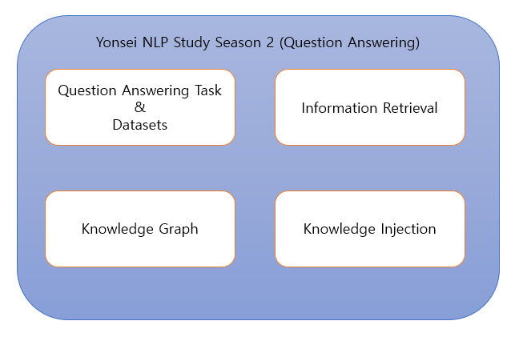

# Yonsei NLP Study Season 2
  
**[About Yonsei NLP Study]**  
Yonsei NLP Study is consisted of 4 Students who are very passionate in the field of Natural Language Processing!  
Every week, each student read papers regarding a certain subject.  
Then, each student gets to present about the topic he prepared for.  
After the presentation, all the students discuss about that paper and share ideas.  
 
**[About Season 2]**  
Yonsei NLP Study Season 2 (2021.09.07 ~ 2021.11.17)  
Main Topic : Question Answering and Various Techniques needed to solve QA Tasks  
Among the 4 members, Seungone Kim and Sejune Joo participated in this topic!  
 
**[About this repository]**  
This repository contains presentation materials, links to presentation videos, and a summary of all the papers we have studied in Yonsei NLP Study Season2(2021.09.08~2021.11.17). Our Main Topic was Question Answering and the various techniques needed to solve QA. We have covered 55 papers in total!  
 
## About the Members
* [Seungone Kim(김승원)](https://github.com/SeungoneKim) - Leader!
* [Sejune Joo(주세준)](https://github.com/joocjun)

## Link to Presentation(Youtube)
* [Information Retrieval (Seungone Kim)](https://www.youtube.com/watch?v=JvNX5XYxBjk&t=1392s)
* [Knowledge Graph & Commonsense Knowledge Graph (Seungone Kim)](https://www.youtube.com/watch?v=PxoDXV2Ep-4&t=2272s)
* [Knowledge Injection & Domain Adaptation (Seungone Kim)](https://www.youtube.com/watch?v=0DBNgkzaZqY&t=755s)

## List of Papers we covered
The following are the list of 55 papers  

### TALK 1 : Question Answering Tasks & Datasets (Seungone Kim)
* [Wikiqa : A challenge dataset for open-domain question answering](https://aclanthology.org/D15-1237.pdf)
* [SQuAD : 100,000+ Questions for Machine Comprehension of Text](https://arxiv.org/abs/1606.05250)
* [MS MARCO : A Human Generated MAchine Reading COmprehension Dataset](https://openreview.net/forum?id=rJ-Qj8-_ZH)
* [TriviaQA: A Large Scale Distantly Supervised Challenge Dataset for Reading Comprehension](https://arxiv.org/abs/1705.03551)
* [RACE: Large-scale ReAding Comprehension Dataset From Examinations](https://arxiv.org/abs/1704.04683)
* [Do We Know What We Don’t Know? Studying Unanswerable Questions beyond SQuAD 2.0](https://aclanthology.org/2021.findings-emnlp.385/)
* [HotpotQA: A Dataset for Diverse, Explainable Multi-hop Question Answering](https://arxiv.org/abs/1809.09600)
* [The NarrativeQA Reading Comprehension Challenge](https://arxiv.org/abs/1712.07040)
* [Can a Suit of Armor Conduct Electricity? A New Dataset for Open Book Question Answering](https://arxiv.org/abs/1809.02789)
* [Cosmos QA: Machine Reading Comprehension with Contextual Commonsense Reasoning](https://arxiv.org/abs/1909.00277)
* [DROP: A Reading Comprehension Benchmark Requiring Discrete Reasoning Over Paragraphs](https://arxiv.org/abs/1903.00161)
* [ELI5: Long Form Question Answering](https://arxiv.org/abs/1907.09190)
* [SuperGLUE: A Stickier Benchmark for General-Purpose Language Understanding Systems](https://arxiv.org/abs/1905.00537)
* [CoQA: A Conversational Question Answering Challenge](https://arxiv.org/abs/1808.07042)
* [PubMedQA: A Dataset for Biomedical Research Question Answering](https://arxiv.org/abs/1909.06146)
* [ANTIQUE: A Non-Factoid Question Answering Benchmark](https://arxiv.org/abs/1905.08957)
* [ReClor: A Reading Comprehension Dataset Requiring Logical Reasoning](https://arxiv.org/abs/2002.04326)
* [WinoGrande: An Adversarial Winograd Schema Challenge at Scale](https://arxiv.org/abs/1907.10641)
* [LogiQA: A Challenge Dataset for Machine Reading Comprehension with Logical Reasoning](https://arxiv.org/abs/2007.08124)

### TALK 1 : Machine Reading Comprehension (Seungone Kim & Sejune Joo)
* [Bidirectional Attention Flow for Machine Comprehension](https://arxiv.org/abs/1611.01603)
* [FusionNet: Fusing via Fully-Aware Attention with Application to Machine Comprehension](https://arxiv.org/abs/1711.07341)
* [SG-Net: Syntax-Guided Machine Reading Comprehension](https://arxiv.org/abs/1908.05147)
* [Retrospective Reader for Machine Reading Comprehension](https://arxiv.org/abs/2001.09694)

### TALK 2 : Information Retrieval (Seungone Kim)
* [ColBERT : Efficient and Effective Passage Search via Contextualized Late Interaction over BERT](https://arxiv.org/abs/2004.12832)
* [RepBERT : Contextualized Text Embeddings for First-Stage Retrieval](https://arxiv.org/abs/2006.15498)
* [Dense Passage Retrieval for Open-Domain Question Answering](https://arxiv.org/abs/2004.04906)
* [COIL : Revisit Exact Lexical Match in Information Retrieval with Contextualized Inverted List](https://arxiv.org/abs/2104.07186)

### TALK 2 : Information Retrieval & Open Domain QA (Sejune Joo)
* [Reading Wikipedia to Answer Open-Domain Questions](https://arxiv.org/abs/1704.00051)
* [Latent Retrieval for Weakly Supervised Open Domain Question Answering](https://arxiv.org/abs/1906.00300)
* [REALM: Retrieval-Augmented Language Model Pre-Training](https://arxiv.org/abs/2002.08909)
* [Retrieval-Augmented Generation for Knowledge-Intensive NLP Tasks](https://arxiv.org/abs/2005.11401)

### TALK 3 : Knowledge Graph Completion (Seungone Kim)
* [Translating embeddings for modeling multi-relational data](https://proceedings.neurips.cc/paper/2013/hash/1cecc7a77928ca8133fa24680a88d2f9-Abstract.html)
* [Knowledge Graph Embedding by Translating on Hyperplanes](https://ojs.aaai.org/index.php/AAAI/article/view/8870)
* [Learning Entity and Relation Embedding for Knowledge Graph Completion](https://ojs.aaai.org/index.php/AAAI/article/view/9491)
* [Embedding Entities and Relations for Learning and Inference in Knowledge Bases](https://arxiv.org/abs/1412.6575)
* [Complex Embeddings for Simple Link Prediction](https://arxiv.org/abs/1606.06357)
* [Open-World Knowledge Graph Completion](https://arxiv.org/abs/1711.03438)
* [Commonsense Knowledge Base Completion](https://aclanthology.org/P16-1137.pdf)

### TALK 3 : Commonsense Knowledge Graph Construction (Seungone Kim)
* [ConceptNet 5.5: An Open Multilingual Graph of General Knowledge](https://arxiv.org/abs/1612.03975)
* [ATOMIC: An Atlas of Machine Commonsense for If-Then Reasoning](https://arxiv.org/abs/1811.00146)
* [COMET: Commonsense Transformers for Automatic Knowledge Graph Construction](https://arxiv.org/abs/1906.05317)

### TALK 3 : Commonsense Knowledge Graph & QA (Sejune Joo)
* [Dynamic Neuro-Symbolic Knowledge Graph Construction for Zero-shot Commonsense Question Answering](https://arxiv.org/abs/1911.03876)

### TALK 4 : Internal Knowledge Base(LM) vs External Knowledge Base Analysis (Seungone Kim)
* [Language Models as Knowledge Bases?](https://arxiv.org/abs/1909.01066)
* [How Much Knowledge Can You Pack Into the Parameters of a Language Model?](https://arxiv.org/abs/2002.08910)
* [Birds have four legs?! NumerSense: Probing Numerical Commonsense Knowledge of Pre-trained Language Models](https://arxiv.org/abs/2005.00683)
* [Improving Question Answering with External Knowledge](https://arxiv.org/abs/1902.00993)
* [Does External Knowledge Help Explainable Natural Language Inference? Automatic Evaluation vs. Human Ratings](https://arxiv.org/abs/2109.07833)

### TALK 4 : Domain Adaptation (Seungone Kim)
* [SciBERT: A Pretrained Language Model for Scientific Text](https://arxiv.org/abs/1903.10676)
* [Don't Stop Pretraining: Adapt Language Models to Domains and Tasks](https://arxiv.org/abs/2004.10964)
* [UDALM: Unsupervised Domain Adaptation through Language Modeling](https://arxiv.org/abs/2104.07078)

### TALK 4 : Knowledge Injection (Seungone Kim)
* [ERNIE: Enhanced Language Representation with Informative Entities](https://arxiv.org/abs/1905.07129)
* [Knowledge Enhanced Contextual Word Representations](https://arxiv.org/abs/1909.04164)
* [K-BERT: Enabling Language Representation with Knowledge Graph](https://arxiv.org/abs/1909.07606)
* [LUKE: Deep Contextualized Entity Representations with Entity-aware Self-attention](https://arxiv.org/abs/2010.01057)
* [KEPLER: A Unified Model for Knowledge Embedding and Pre-trained Language Representation](https://arxiv.org/abs/1911.06136)
